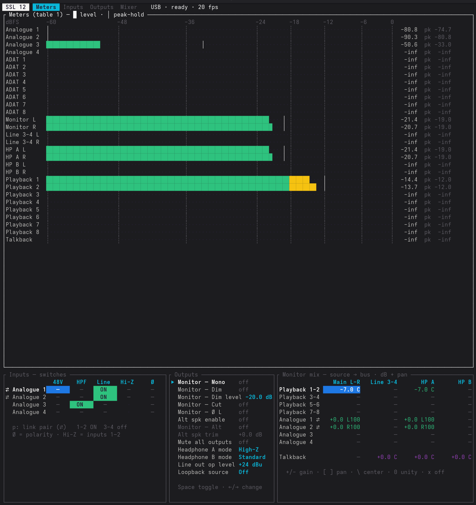

# ssl12-ctl

Userspace control of the **Solid State Logic SSL 12** mixer/DSP on Linux, over the
device's reverse-engineered USB **vendor control protocol** (pure-Rust [`nusb`](https://crates.io/crates/nusb)).

> **Unofficial project.** Not affiliated with, authorized, or endorsed by Solid State
> Logic. See [Disclaimer](#disclaimer) below.

Audio I/O is *not* handled here — the SSL 12 is a class-compliant **USB Audio Class 2.0**
device, so recording/playback and standard volume/mute work natively via the kernel's
`snd-usb-audio`. This crate only drives the SSL-specific mixer/DSP controls (monitor mix,
input gain switches, 48V, routing, headphone modes, operating levels, etc.).

Protocol details: see [`docs/PROTOCOL.md`](docs/PROTOCOL.md); code layout in
[`docs/ARCHITECTURE.md`](docs/ARCHITECTURE.md).



## Status

**Working on hardware** (Linux, 2026-06-23): control writes (48V, mix, mute, routing) and the
live meter stream are confirmed against a real SSL 12 — including after the move to the pure-Rust
[`nusb`](https://crates.io/crates/nusb) USB backend (no libusb). The transport turned out to be an
**FTDI UART bridge** — it needs an FTDI port-open, per-packet status-byte stripping, and a periodic
`0x1b` keepalive in addition to the tile-init handshake (see `docs/PROTOCOL.md` §0.5). The
protocol layer (framing/CRC/Q6.25/message building) is unit-tested and verified against captures.

Remaining work is feature breadth, not bring-up: a fuller TUI (mixer matrix view), and pinning a
few low-value meter sub-orders.

## Build & test

```sh
cargo test          # runs the protocol unit tests (no hardware needed)
cargo test --features dev-tools   # also runs the offline capture-decoder tests
cargo build --release
```

No system libraries required — the USB backend ([`nusb`](https://crates.io/crates/nusb)) is pure
Rust, talking to the kernel directly (usbfs on Linux, WinUSB on Windows, IOKit on macOS).

### Linux permissions (udev)

By default opening the device needs `sudo`. To get no-sudo access, install a udev rule that grants
the logged-in user an ACL on the control device. The easiest way:

```sh
ssl12ctl install-udev      # writes the rule (re-runs itself under sudo), reloads udev
                           # then unplug/replug the SSL 12. `uninstall-udev` reverses it.
```

Prefer to do it by hand? Copy [`packaging/70-ssl12.rules`](packaging/70-ssl12.rules) — that's the
exact rule the command embeds — to `/etc/udev/rules.d/`:

```sh
sudo install -m644 packaging/70-ssl12.rules /etc/udev/rules.d/
sudo udevadm control --reload && sudo udevadm trigger
```

The rule (`SUBSYSTEM=="usb", ATTR{idVendor}=="31e9", ATTR{idProduct}=="0024", TAG+="uaccess"`)
matches only the control device — the audio function is left to the kernel — and the `70-` prefix
is required so it sorts before udev's `70-uaccess.rules` (see the file's header for why).

## Usage

```sh
ssl12ctl info
ssl12ctl phantom 0 on        # 48V on mic input 1 (index 0)
ssl12ctl hiz 0 on            # Hi-Z / instrument on input 1
ssl12ctl line 0 on           # line input on channel 1
ssl12ctl xpoint 10 -10.0     # monitor-mix crosspoint #10 to -10 dB
ssl12ctl level 0 -6.0        # OUTPUT_LEVEL index 0 to -6 dB
ssl12ctl loopback playback_1_2
ssl12ctl oplevel 0 plus24    # line output operating level +24 dBu
ssl12ctl hpmode 4 high_impedance
ssl12ctl mute on
ssl12ctl listen              # print device->host frames (state echoes + meters)
ssl12ctl meters              # live text meter bars
```

## Terminal UI (`ssl12tui`)

A ratatui meter + control surface. It runs against the live device **or** a built-in **mock**
backend (synthetic meters + echoed control state), so the UI is fully developable with no
hardware and no libusb — handy on a laptop away from the bench:

```sh
# Live device (needs the usb feature + hardware):
cargo run --bin ssl12tui

# Mock, no hardware, no libusb (any OS):
cargo run --no-default-features --features tui --bin ssl12tui
#   (or `cargo run --bin ssl12tui -- --mock` to force the sim while built with usb)
```

Four screens (`Tab` cycles):
- **Meters** — tri-color bars for all 29 channels (display only).
- **Inputs** — per-input switch grid (48V / HPF / Line / Hi-Z / Ø polarity); `↑/↓/←/→` select,
  `Space` toggle. Hydrates from the device's connect-time parameter dump.
- **Outputs** — monitor Mono/Dim/Cut + hardware mute (device-reported params), and headphone
  gain mode / line operating level (host-owned coefficient selections); `↑/↓` row, `Space`
  toggle, `←/→` change selection.
- **Mixer** — the monitor-mix matrix (sources × buses); `↑/↓/←/→` move cell, `+/-` gain,
  `0` unity, `x`/`Backspace` off.

Common keys: `m` mute outputs · `q` quit. The Inputs grid reflects device-authoritative parameter
state; the Mixer grid edits a host-side `MixMatrix` and writes `MIXER_CROSSPOINT_TABLE` cells (the
mix is host-owned — see `docs/PROTOCOL.md` §8). Against the mock, both echo straight back.

**Mix presets.** The mix is host-authoritative, so the TUI persists it: `s` (on the Mixer screen)
saves to a TOML preset at `<config dir>/ssl12/mix.toml` (e.g. `~/.config/ssl12/mix.toml`), and it's
loaded + pushed to the device on launch. The file is hand-editable — `source → { bus = dB }`, omit a
bus to leave it off.

## Offline capture decoding (`capturedecode`)

Decodes USBPcap **hex-dump text** exports into DSP messages — no hardware, no libusb. This is a
reverse-engineering tool, so it lives behind the **`dev-tools`** feature (off by default — a normal
build/install won't include it):

```sh
cargo run --no-default-features --features dev-tools --bin capturedecode -- capture.txt           # per-message
cargo run --no-default-features --features dev-tools --bin capturedecode -- capture.txt --summary # grouped
cargo run --no-default-features --features dev-tools --bin capturedecode -- capture.txt --filter CROSSPOINT
```

This is the tool for mapping the crosspoint matrix: move ONE mixer cell in SSL 360, capture,
then `--summary` shows exactly which `(control, number, index)` changed and its dB span.
Derived so far: the matrix is `index = destination*30 + source_slot` (8 destinations × 30 slots).

## Safety

`device.rs` keeps an allowlist mindset: it **refuses** the firmware/flash/FPGA USB message
codes (10–18, 27) for arbitrary payloads, since those are the only commands that write
non-volatile memory and could brick the unit. Code 27 (`0x1b`) is special: the SSL 12 reuses
it as a benign **keepalive** with a 1-byte rolling counter, which `heartbeat()` sends directly
(the guard still blocks any other 27 payload). All exposed controls are **volatile DSP state**
— a power cycle restores defaults. The device's test / power-rail / protection coefficients
(numbers 15/17/18/19) are intentionally **not** mapped or wrapped in high-level helpers. See
`docs/PROTOCOL.md` and the project notes for the full risk discussion.

## Disclaimer

`ssl12-ctl` is an independent, unofficial project. It is **not** affiliated with, authorized
by, endorsed by, or sponsored by Solid State Logic. "Solid State Logic", "SSL", and "SSL 12"
are trademarks of their respective owner, used here only to identify the hardware this tool
interoperates with.

The USB control protocol was **reverse-engineered** and is undocumented by the manufacturer.
This tool has been **tested extensively against real SSL 12 hardware**, it drives only
**volatile** DSP state, and it deliberately refuses the firmware/flash message codes (see
[Safety](#safety)) — so in normal use a power cycle restores defaults and nothing should be
permanently altered.

That said, the software is provided **"as is", without warranty of any kind** (see
[LICENSE-MIT](LICENSE-MIT) / [LICENSE-APACHE](LICENSE-APACHE)). You run it **at your own risk**,
and the authors accept **no liability** for any damage, data loss, or other harm to your device
or system that may result from its use.
